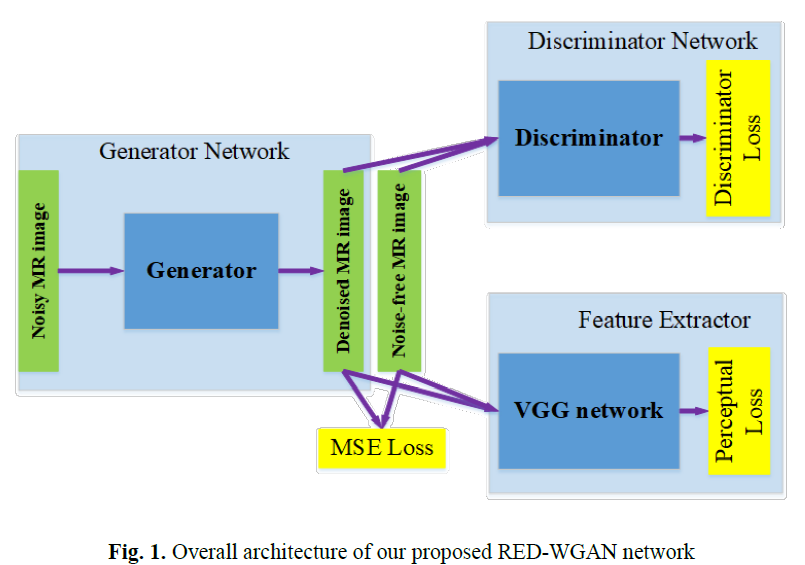
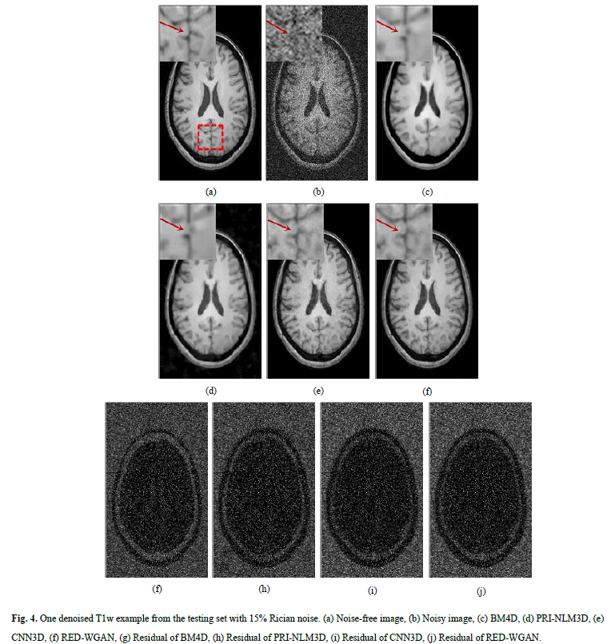
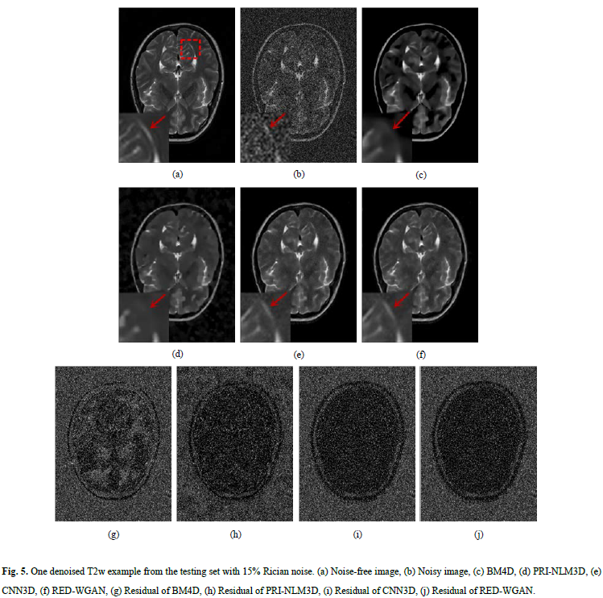
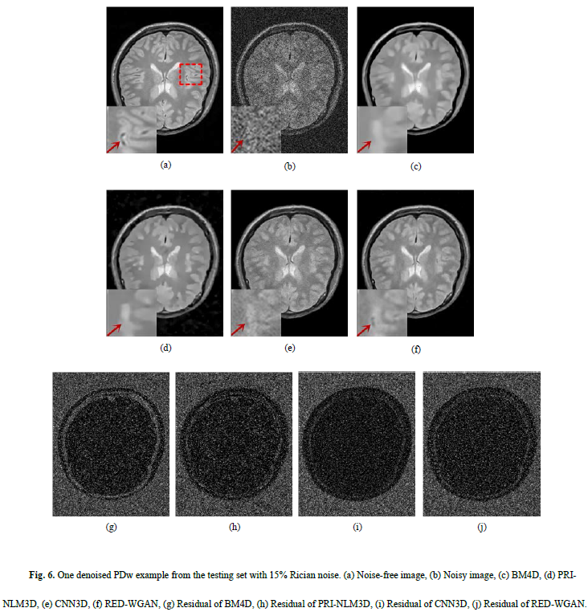
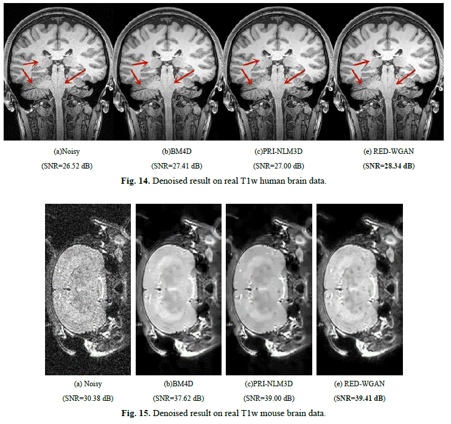

# [Denoising of 3D Magnetic Resonance Images Using a Residual Encoder-Decoder Wasserstein Generative Adversarial Network](https://arxiv.org/abs/1808.03941)

This is the source code of this paper. In this paper, we propose a novel method based on the Wasserstein generative adversarial network to remove the Rician noise in MR images while effectively preserving the structural details. This network aims to process 3D volume data using a 3D convolutional neural network. In addition to the introduction of the WGAN framework, there are two more advantages to our method: the innovative generator structure and mixed weighted loss function. The generator is con-structed with an autoencoder structure, which symmetrically contains convolutional and deconvolutional layers, aided by a residual structure. Another improvement of our method is the adaptation of the mixed loss function, which combines the MSE and perceptual losses with a weighted form.

## 1. The description of contents of this reoisutiry:

The contents of this repository are  as follows:
1. `data`: A folder which holds the dataset.
2. `image`: A foleder which holds the images for this repository.
3. `loss`: A folder which holds the training loss.
4. `model`: A folder which holds the parameters of the neural network model.
5. `result`: A folder which holds some the result of test.
6. `data.py`: A Python file which implete the class Dataset of Pytorch, which serves the `model2.py` and `model5.py`.
7. `mixdata.py`: A Python file which implete the class Dataset of Pytorch, which serves the `model7.py`.
8. `model2.py`: A Python file which is the model 'CNN3D'.
9.  `model5.py`: A Python file which is the model 'RED-WGAN'.
10. `model7.py`: A Python file which is same as the `model5.py` and called 'RED-WGAN-m', it is trainned whit a mixed noise level.
11. `preprocessing.py`: A preprocessing file, for example patching and merging the image, add Rician noise and so on.

# 2. The structure of the model in this paper.

## 3. The denoising result on testing dataset.

## 4. The denoising result on real data.
